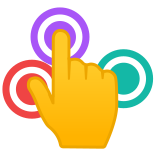
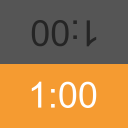

<h1>
  Games by
  <picture>
    <source media="(prefers-color-scheme: dark)" srcset="https://raw.githubusercontent.com/NotWoods/NotWoods/main/logo-dark.svg">
    
  </picture>
</h1>

Games and tools I've created! All available under
[games.tigeroakes.com](https://games.tigeroakes.com).

## [Last Finger Standing](last-finger-standing)

Need to pick someone to go first? To pay the bill? To buy milk? Just have
everyone put a finger on the screen and wait. Last Finger Standing will make
your choice automatically! A quick and easy app to randomly select someone from
a group of people.

https://games.tigeroakes.com/last-finger-standing/

## [Gameclock](gameclock)

Time your chess games, jenga games, and other board games.

https://games.tigeroakes.com/gameclock/

## [Quest Kit](https://github.com/NotWoods/quest-tools)

The adventure's toolkit for the [Quest TTRPG](https://www.adventure.game/).

https://questkit.app/

## [Pass the Bomb](https://github.com/NotWoods/pass-the-bomb)

A multiplayer word game where players must quickly think of words to pass the
bomb to another player before time runs out. Created with a hackathon team for
UBC Local Hack Day 2016.

https://pass-the-bomb.glitch.me/

## [Where's the Beep?](wheres-the-beep)

Test your echolocation abilities in this WebXR game based around positional
audio.

https://games.tigeroakes.com/wheres-the-beep/

## [Minecraft Tools](minecraft-tools)

A collection of Javascript programs to use with Minecraft.

https://games.tigeroakes.com/minecraft-tools/

## [Bit Ball](https://github.com/NotWoods/bit-ball)

A physics puzzle game for Android and one of my very first large programming
projects, originally built in 2012.

https://games.tigeroakes.com/bit-ball/
